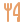
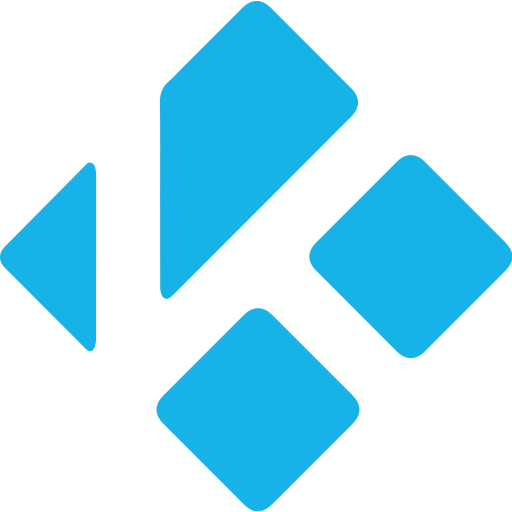
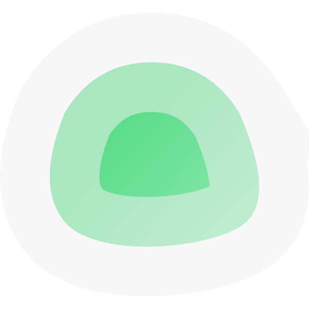

# Configuration des addons

Cette page décrit les réglages de chaque addon du store. La configuration se fait depuis l'écran tactile via le bouton **⚙** de chaque addon, ou à distance avec l'outil `panda-cfg.py` en SSH.

*37 addons au total. Document généré automatiquement depuis les manifests.*

## Maison

###  Congélateur — v0.2.5

Inventaire du congélateur, synchronisé avec KitchenOwl. Façade du hub cuisine.

| Champ | Libellé | Type |
|---|---|---|
| `category` | Catégorie « congélateur » (optionnel) | texte — ex. `Congélateur` |

###  Courses — v0.2.5

Liste de courses partagée, synchronisée avec KitchenOwl. Façade du hub cuisine.

*Aucun réglage nécessaire (configuration héritée ou automatique).*

###  Hub KitchenOwl — v0.2.6

Hub cuisine KitchenOwl : liste de courses, garde-manger, congélateur, recettes et planning de repas. Base partagée par les addons Courses, Stock, Congélateur, Recettes et Repas.

| Champ | Libellé | Type |
|---|---|---|
| `url` | URL KitchenOwl | texte — ex. `http://kitchenowl.example.com:8080` |
| `token` | Jeton KitchenOwl | secret (masqué) |
| `household` | Maison (id ou nom, si plusieurs) | texte — ex. `1` |

###  Jardin — v0.3.2

Suivi du potager et du jardin : plantations en cours, calendrier d'arrosage, récoltes et rappels de saison.

*Aucun réglage nécessaire (configuration héritée ou automatique).*

###  Recettes — v0.2.5

Recettes de cuisine, synchronisées avec KitchenOwl. Façade du hub cuisine.

*Aucun réglage nécessaire (configuration héritée ou automatique).*

###  Repas semaine — v0.3.4

Planning des repas de la semaine, synchronisé avec KitchenOwl. Façade du hub cuisine.

*Aucun réglage nécessaire (configuration héritée ou automatique).*

###  Stock cuisine — v0.2.5

Garde-manger et stock des placards, synchronisés avec KitchenOwl. Façade du hub cuisine.

*Aucun réglage nécessaire (configuration héritée ou automatique).*

## Quotidien

###  Abonnements — v0.4.3

Abonnements via Wallos (Fourmi) : budget du mois (dû/prélevé/restant), tous les abonnements en cartes, répartition par catégorie (donut) et prévisionnel des prochains mois. Disposition (onglets ou page unique) et horizon configurables.

| Champ | Libellé | Type |
|---|---|---|
| `url` | URL Wallos | texte — ex. `http://wallos.example.com:8282` |
| `apikey` | Clé API (Paramètres → API) | secret (masqué) |
| `layout` | Disposition | liste déroulante — choix : Onglets (Ce mois · Tous · Catégories · Prévisionnel) / Page unique (tout empilé) |
| `forecast` | Prévisionnel — nombre de mois | liste déroulante — choix : 6 mois / 3 mois / 12 mois (année) |

###  Agenda — v0.3.2

Agenda CalDAV (Infomaniak, Nextcloud, Baïkal, Radicale, Fastmail, Google…) : événements à venir, notifications, ajout d'événements.

| Champ | Libellé | Type |
|---|---|---|
| `url` | Serveur CalDAV | texte — ex. `https://exemple.com/dav (ou https://sync.infomaniak.com)` |
| `user` | Identifiant / e-mail | texte |
| `pass` | Mot de passe (d'application si dispo) | secret (masqué) |
| `calendar` | Calendrier par défaut (nouveaux événements) | texte — ex. `Perso` |
| `notif` | Notifications dans le bandeau | liste déroulante — choix : Activées / Désactivées |

###  Budget — v0.2.4

Budget personnel via Actual Budget (passerelle actual-http-api) : soldes des comptes, transactions récentes et suivi des catégories.

| Champ | Libellé | Type |
|---|---|---|
| `url` | URL actual-http-api | texte — ex. `http://budget.example.com:5007` |
| `apikey` | Clé API | secret (masqué) |
| `budget` | ID de synchronisation du budget | texte — ex. `laisser vide pour lister` |

###  Marée — v0.3.4

Horaires et coefficients de marée (pleines et basses mers) via l'API api-maree.fr.

| Champ | Libellé | Type |
|---|---|---|
| `site` | Port (api-maree.fr) | texte — ex. `trehiguier` |
| `apikey` | Clé api-maree.fr (inscription gratuite) | secret (masqué) |

###  Soleil & Lune — v1.0.3

Lever et coucher du soleil, durée du jour, phase et illumination de la lune — calculés localement, sans connexion.

| Champ | Libellé | Type |
|---|---|---|
| `lat` | Latitude | texte — ex. `48.8566` |
| `lon` | Longitude | texte — ex. `2.3522` |
| `tz` | Décalage horaire (heures, ex. 2 en été) | texte — ex. `2` |

###  Transport — v0.2.3

Prochains passages de train, métro, tram et bus via l'API Navitia (données SNCF / transporteurs).

| Champ | Libellé | Type |
|---|---|---|
| `url` | URL de l'API | texte — ex. `https://api.sncf.com/v1` |
| `token` | Jeton d'API | secret (masqué) |
| `coverage` | Couverture | texte — ex. `sncf (ou fr-ne, fr-nw… sur navitia.io)` |

## Médias

###  Emby — v0.2.2

Emby : statistiques (films, séries, épisodes, lectures en cours), ce qui est en lecture maintenant, reprise (continuer à regarder), bibliothèques et ajouts récents avec jaquettes. Bascule liste / cartes ; fiche détail avec résumé, genres et bouton « Lire dans Emby ».

| Champ | Libellé | Type |
|---|---|---|
| `url` | URL Emby | texte — ex. `http://emby.local:8096` |
| `apikey` | Clé API | secret (masqué) |

###  Instagram — v0.4.3

Photos Instagram récupérées via instaloader : dernières publications des comptes suivis, affichées en mosaïque, synchronisation planifiée.

| Champ | Libellé | Type |
|---|---|---|
| `path` | Dossier des médias | texte — ex. `~/instagram` |
| `login` | Identifiant Instagram (pseudo — pour la synchro) | texte — ex. `ton_pseudo` |
| `targets` | À télécharger | liste déroulante — choix : Publications sauvegardées / Mon profil (mes publications) |
| `media` | Type de médias | liste déroulante — choix : Photos et vidéos / Photos uniquement / Vidéos uniquement |
| `profile` | Profil affiché par défaut | texte — ex. `(auto : le plus fourni)` |

###  Kodi — v0.3.2

Kodi (Cormoran/Ours) : télécommande complète (lecture, navigation, volume) et bibliothèque — films et épisodes récemment ajoutés avec affiches. Deux onglets : Lecture et Bibliothèque.

| Champ | Libellé | Type |
|---|---|---|
| `url` | URL Kodi (JSON-RPC) | texte — ex. `http://kodi.example.com:8080` |
| `user` | Utilisateur | texte |
| `pass` | Mot de passe | secret (masqué) |

###  Livres — v0.4.2

Kavita (Hérisson) : bibliothèques, lectures en cours, nouveautés, recherche et LISEUSE intégrée — lecture des BD page par page au tactile (zones gauche/droite/centre, curseur, progression synchronisée avec Kavita).

| Champ | Libellé | Type |
|---|---|---|
| `url` | URL Kavita | texte — ex. `http://kavita.example.com` |
| `apikey` | Clé API (Compte → Clé API) | secret (masqué) |

###  Musique — v0.2.3

Lecteur audio branché sur Navidrome (Subsonic) : lecture en fond, favoris et navigation dans la bibliothèque.

| Champ | Libellé | Type |
|---|---|---|
| `url` | URL Navidrome | texte — ex. `http://navidrome.example.com` |
| `user` | Utilisateur | texte |
| `pass` | Mot de passe | secret (masqué) |

## Services

###  Arcane — v0.3.3

Conteneurs Docker via Arcane, tous environnements agrégés (badge machine) : stats, liste ou cartes avec ports et état, actions démarrer / arrêter / redémarrer. Arrêtés grisés, mises à jour signalées.

| Champ | Libellé | Type |
|---|---|---|
| `url` | URL Arcane | texte — ex. `http://arcane.example.com:3552` |
| `apikey` | Clé API (arc_...) | secret (masqué) |

###  Forgejo — v0.3.1

Dépôts Forgejo — cartes ou liste, recherche, historique des derniers commits.

| Champ | Libellé | Type |
|---|---|---|
| `url` | URL Forgejo | texte — ex. `https://forgejo.example.com:3000` |
| `token` | Token d'accès (Paramètres → Applications) | secret (masqué) |
| `view` | Affichage des dépôts | liste déroulante — choix : Cartes / Liste |
| `hist` | Historique des commits (panneau de droite) | liste déroulante — choix : 10 derniers / 5 derniers / 20 derniers / Masqué |

###  GitHub — v0.1.4

GitHub : tes dépôts publics et privés (étoiles, issues, dernier push), notifications non lues, issues et pull requests ouvertes, et activité récente du compte.

| Champ | Libellé | Type |
|---|---|---|
| `token` | Token d'accès (PAT) | secret (masqué) — ex. `ghp_…` |

###  Grafana — v0.3.5

Supervision Grafana : santé et version, sources de données et leur état, alertes actives, liste des dashboards, et rendu à la demande d'un panel (image PNG via le renderer).

| Champ | Libellé | Type |
|---|---|---|
| `url` | URL Grafana | texte — ex. `http://grafana.local:3000` |
| `apikey` | Clé API (service account token) | secret (masqué) |
| `theme` | Thème du rendu des panels | liste déroulante — choix : Sombre / Clair |

###  Hetzner — v0.5.1

Hetzner : serveurs Cloud multi-projets (jusqu'à 8 projets, un token par projet), état/type/IP/datacenter/coût mensuel, volumes, Storage Boxes (quota utilisé/total, drapeaux) et serveurs dédiés Robot. Cloud et Robot activables séparément.

| Champ | Libellé | Type |
|---|---|---|
| `cloud_on` | Activer Cloud (serveurs + storage boxes) | interrupteur |
| `name1` | Projet 1 — nom | texte — `ex. perso, homelab…` |
| `token1` | Projet 1 — token | secret (masqué) — ex. `token API du projet` |
| `name2` | Projet 2 — nom | texte — `ex. perso, homelab…` |
| `token2` | Projet 2 — token | secret (masqué) — ex. `token API du projet` |
| `name3` | Projet 3 — nom | texte — `ex. perso, homelab…` |
| `token3` | Projet 3 — token | secret (masqué) — ex. `token API du projet` |
| `name4` | Projet 4 — nom | texte — `ex. perso, homelab…` |
| `token4` | Projet 4 — token | secret (masqué) — ex. `token API du projet` |
| `name5` | Projet 5 — nom | texte — `ex. perso, homelab…` |
| `token5` | Projet 5 — token | secret (masqué) — ex. `token API du projet` |
| `name6` | Projet 6 — nom | texte — `ex. perso, homelab…` |
| `token6` | Projet 6 — token | secret (masqué) — ex. `token API du projet` |
| `name7` | Projet 7 — nom | texte — `ex. perso, homelab…` |
| `token7` | Projet 7 — token | secret (masqué) — ex. `token API du projet` |
| `name8` | Projet 8 — nom | texte — `ex. perso, homelab…` |
| `token8` | Projet 8 — token | secret (masqué) — ex. `token API du projet` |
| `robot_on` | Activer Robot (serveurs dédiés) | interrupteur |
| `robot_user` | Utilisateur webservice Robot | texte — ex. `#ws+XXXXX` |
| `robot_pass` | Mot de passe webservice | secret (masqué) |

###  Infomaniak — v0.6.1

Infomaniak multi-organisations : balaie automatiquement tous tes comptes (Koody, ES Production…) et agrège domaines, hébergements mail, Cloud/VPS, certificats SSL et hébergements web, avec dates d'expiration, étiquettes et badge organisation. Sections activables séparément. Token unique avec scope accounts requis pour le multi-orga.

| Champ | Libellé | Type |
|---|---|---|
| `token` | Token API Infomaniak | secret (masqué) — ex. `jeton avec scopes accounts, domain, mail, vps…` |
| `show_domains` | Domaines (activé par défaut) | interrupteur |
| `show_mail` | Hébergements mail (activé par défaut) | interrupteur |
| `show_cloud` | Cloud / VPS (activé par défaut) | interrupteur |
| `show_certs` | Certificats SSL (activé par défaut) | interrupteur |
| `show_other` | Hébergements web et autres (activé par défaut) | interrupteur |

###  Mail — v0.1.2

Boîte mail IMAP (Infomaniak, Gmail, Proton Bridge…) : lire les messages, marquer lu/non lu, supprimer.

| Champ | Libellé | Type |
|---|---|---|
| `host` | Serveur IMAP | texte — ex. `mail.infomaniak.com` |
| `port` | Port IMAPS | texte — ex. `993` |
| `user` | Adresse e-mail | texte |
| `pass` | Mot de passe d'application | secret (masqué) |
| `folder` | Dossier | texte — ex. `INBOX` |

###  Malinois — v0.1.2

Trackers privés via tracker-autovisit (Malinois) : état des visites automatiques (OK / échec), dernière visite, alertes, et stats par tracker (ratio, upload, download, bonus). Le site en échec est mis en avant.

| Champ | Libellé | Type |
|---|---|---|
| `url` | URL Malinois | texte — ex. `https://192.168.1.10` |
| `apikey` | Clé API | secret (masqué) |

###  Nextcloud — v0.4.2

. Explorateur avec bascule liste / cartes (vignettes en grille).

| Champ | Libellé | Type |
|---|---|---|
| `url` | URL Nextcloud | texte — ex. `http://nextcloud.example.com` |
| `user` | Utilisateur | texte |
| `pass` | Mot de passe d'application | secret (masqué) |

###  OVH — v0.2.1

OVHcloud : domaines (expiration, offre, DNSSEC), hébergements web, VPS, serveurs dédiés et projets Public Cloud. Sections activables séparément. Authentification par clés API (Application Key/Secret + Consumer Key), lecture seule.

| Champ | Libellé | Type |
|---|---|---|
| `region` | Région API | liste déroulante — choix : Europe / Canada |
| `app_key` | Application Key | secret (masqué) |
| `app_secret` | Application Secret | secret (masqué) |
| `consumer_key` | Consumer Key | secret (masqué) |
| `show_domains` | Domaines (activé par défaut) | interrupteur |
| `show_hosting` | Hébergements web (activé par défaut) | interrupteur |
| `show_vps` | VPS (activé par défaut) | interrupteur |
| `show_dedicated` | Serveurs dédiés (activé par défaut) | interrupteur |
| `show_cloud` | Public Cloud (activé par défaut) | interrupteur |

###  Paperless — v0.3.2

Paperless-ngx (Méduse) : statistiques (documents, réception, correspondants, types, tags), recherche plein-texte, boîte de réception et documents récents avec vignettes. Bascule liste / cartes ; clic pour ouvrir le document.

| Champ | Libellé | Type |
|---|---|---|
| `url` | URL Paperless | texte — ex. `http://paperless.example.com:8010` |
| `token` | Jeton API (Paramètres → Jeton API) | secret (masqué) |

###  Pi-hole — v0.7.1

Supervision Pi-hole v6 multi-instances : ajoute autant de nœuds que tu veux, statistiques détaillées (top domaines/clients, amont DNS, types de requêtes, historique 24 h), couleurs Pi-hole.

| Champ | Libellé | Type |
|---|---|---|
| `name1` | — Pi-hole 1 — Nom | texte — ex. `Principal` |
| `url1` | URL 1 | texte — ex. `http://pihole.local:80` |
| `pass1` | Mot de passe d'application 1 | secret (masqué) |
| `name2` | — Pi-hole 2 — Nom | texte — ex. `Secondaire` |
| `url2` | URL 2 | texte — ex. `http://pihole.local:80` |
| `pass2` | Mot de passe d'application 2 | secret (masqué) |
| `name3` | — Pi-hole 3 — Nom | texte — ex. `Pi-hole 3` |
| `url3` | URL 3 | texte — ex. `http://pihole.local:80` |
| `pass3` | Mot de passe d'application 3 | secret (masqué) |
| `name4` | — Pi-hole 4 — Nom | texte — ex. `Pi-hole 4` |
| `url4` | URL 4 | texte — ex. `http://pihole.local:80` |
| `pass4` | Mot de passe d'application 4 | secret (masqué) |
| `name5` | — Pi-hole 5 — Nom | texte — ex. `Pi-hole 5` |
| `url5` | URL 5 | texte — ex. `http://pihole.local:80` |
| `pass5` | Mot de passe d'application 5 | secret (masqué) |

###  Proxmox — v0.2.3

État de l'hyperviseur Proxmox VE : nœuds, machines virtuelles et conteneurs LXC, charge CPU/RAM et stockage.

| Champ | Libellé | Type |
|---|---|---|
| `url` | URL Proxmox | texte — ex. `https://proxmox.example.com:8006` |
| `token` | Token API | secret (masqué) |

###  Radarr — v0.2.9

Radarr : statistiques (films, disponibles, manquants, file), téléchargements en cours, prochaines sorties et films récemment ajoutés avec affiches. Bascule liste / cartes ; clic pour la fiche détail (résumé, statut, qualité).

| Champ | Libellé | Type |
|---|---|---|
| `url` | URL Radarr | texte — ex. `http://radarr.local:7878` |
| `apikey` | Clé API | secret (masqué) |

###  Sauvegardes — v0.4.2

Liste des sauvegardes vzdump présentes sur les stockages Proxmox, regroupées par VM/CT : dernière sauvegarde, nombre, taille cumulée, fichiers protégés.

| Champ | Libellé | Type |
|---|---|---|
| `url` | URL Proxmox | texte — ex. `https://proxmox.local:8006` |
| `token` | Token API (USER@REALM!ID=UUID) | secret (masqué) |

###  Sonarr — v0.2.7

Sonarr : statistiques (séries, épisodes, file, manquants), téléchargements en cours, épisodes à venir et séries récemment ajoutées avec affiches. Bascule liste / cartes ; clic pour la fiche détail (progression, saisons, statut).

| Champ | Libellé | Type |
|---|---|---|
| `url` | URL Sonarr | texte — ex. `http://sonarr.local:8989` |
| `apikey` | Clé API | secret (masqué) |

###  Uptime Kuma — v0.3.2

Uptime Kuma (Faucon) : statistiques (en ligne, hors ligne, ping moyen), moniteurs en liste ou cartes avec uptime 24 h, temps de réponse et historique récent.

| Champ | Libellé | Type |
|---|---|---|
| `url` | URL Kuma | texte — ex. `http://uptime-kuma.example.com:3001` |
| `slug` | Slug page de statut (vue Infra) | texte — ex. `maison` |
| `apikey` | Clé API (bandeau : flotte complète) | secret (masqué) |
| `label` | Nom de la flotte (bandeau) | texte — ex. `Ménagerie` |
| `format` | Format du bandeau | liste déroulante — choix : Total — En ligne / Total / Pastille — En ligne / Hors ligne / Texte — En ligne / Hors ligne |

###  WatchYourLAN — v0.3.3

Hôtes du réseau via WatchYourLAN (Furet) : nom, IP, MAC, matériel et statut en ligne. Bascule liste / cartes, hôtes hors ligne grisés.

| Champ | Libellé | Type |
|---|---|---|
| `url` | URL WatchYourLAN | texte — ex. `http://watchyourlan.example.com:8840` |

###  Wiki.js — v0.3.3

Wiki.js (Hibou) : statistiques (pages, publiées, brouillons, dossiers), recherche, pages récemment modifiées et arborescence par dossier. Bascule liste / cartes ; clic pour ouvrir la page.

| Champ | Libellé | Type |
|---|---|---|
| `url` | URL Wiki.js | texte — ex. `http://wikijs.example.com:3000` |
| `token` | Token API (Administration → API) | secret (masqué) |

