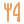
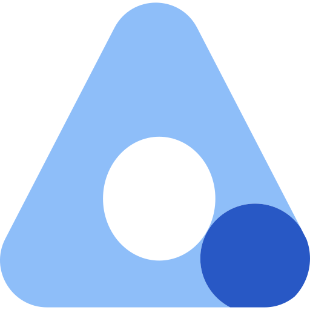
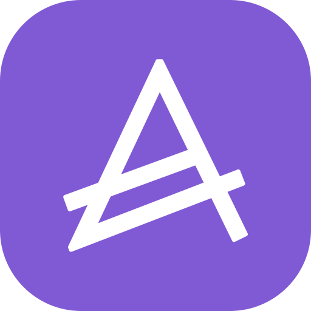
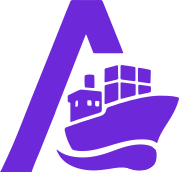
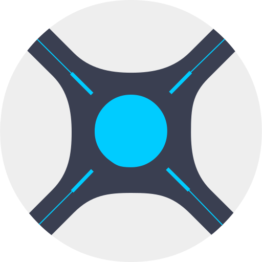
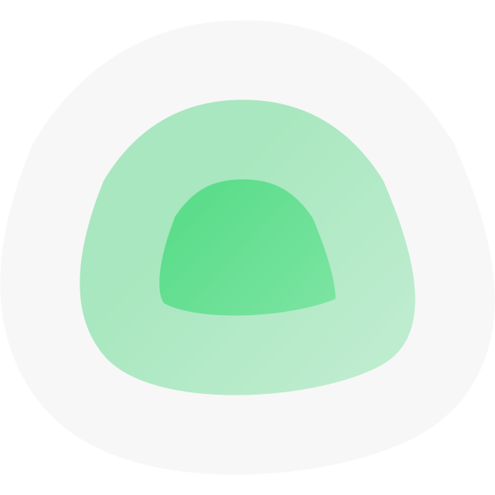

# 🐝 Abeille — le store d'addons de Panda

Abeille est le dépôt d'addons du kiosk domestique **Panda**. Chaque addon apporte une tuile et une vue dédiée à un service de la maison (cuisine, médias, monitoring, quotidien…). Les tuiles arborent le **logo officiel** de chaque application (SVG embarqué, rendu net à toute taille et disponible hors-ligne).

## Installation du store

Dans Panda : **⚙ Réglages → Store**. Le store officiel est préconfiguré ; les addons s'installent et se mettent à jour en un tap depuis l'onglet Store. Les mises à jour disponibles sont signalées par un badge **⬆ MISE À JOUR** et une pastille sur l'icône du Store.

L'index du store est **signé** (Ed25519) : Panda vérifie la signature avant d'accepter tout catalogue, garantissant que les addons proviennent bien de cette source.

## Configuration des addons

📖 **[Voir la page complète de configuration des addons »](CONFIGURATION.md)** — tous les réglages, champ par champ.

Après installation, chaque addon se configure depuis sa tuile via l'icône **⚙** (URL du service, identifiants ou clés API). Le bouton **Tester** valide la connexion avant d'enregistrer. La configuration est relue à chaud, sans redémarrage.

## Catalogue — 38 addons

| | Addon | Catégorie | Description |
|---|---|---|---|
|  | Congélateur | Maison | Inventaire du congélateur, synchronisé avec KitchenOwl. Façade du hub cuisine. |
|  | Courses | Maison | Liste de courses partagée, synchronisée avec KitchenOwl. Façade du hub cuisine. |
|  | Hub KitchenOwl | Maison | Hub cuisine KitchenOwl : liste de courses, garde-manger, congélateur, recettes et planning de repas. Base partagée par les… |
|  | Jardin | Maison | Suivi du potager et du jardin : plantations en cours, calendrier d'arrosage, récoltes et rappels de saison. |
|  | Recettes | Maison | Recettes de cuisine, synchronisées avec KitchenOwl. Façade du hub cuisine. |
|  | Repas semaine | Maison | Planning des repas de la semaine, synchronisé avec KitchenOwl. Façade du hub cuisine. |
|  | Stock cuisine | Maison | Garde-manger et stock des placards, synchronisés avec KitchenOwl. Façade du hub cuisine. |
|  | Abonnements | Quotidien | Abonnements via Wallos (Fourmi) : budget du mois (dû/prélevé/restant), tous les abonnements en cartes, répartition par… |
|  | Agenda | Quotidien | Agenda CalDAV (Infomaniak, Nextcloud, Baïkal, Radicale, Fastmail, Google…) : événements à venir, notifications, ajout… |
|  | Budget | Quotidien | Budget personnel via Actual Budget (passerelle actual-http-api) : soldes des comptes, transactions récentes et suivi des… |
|  | Marée | Quotidien | Horaires et coefficients de marée (pleines et basses mers) via l'API api-maree.fr. |
|  | Soleil & Lune | Quotidien | Lever et coucher du soleil, durée du jour, phase et illumination de la lune — calculés localement, sans connexion. |
|  | Transport | Quotidien | Prochains passages de train, métro, tram et bus via l'API Navitia (données SNCF / transporteurs). |
|  | Arcane | Services | Conteneurs Docker via Arcane, tous environnements agrégés (badge machine) : stats, liste ou cartes avec ports et état, actions… |
|  | Forgejo | Services | Dépôts Forgejo — cartes ou liste, recherche, historique des derniers commits. |
|  | GitHub | Services | GitHub : tes dépôts publics et privés (étoiles, issues, dernier push), notifications non lues, issues et pull requests… |
|  | Grafana | Services | Supervision Grafana : santé et version, sources de données et leur état, alertes actives, liste des dashboards, et rendu à la… |
|  | Hetzner | Services | Hetzner : serveurs Cloud multi-projets (jusqu'à 8 projets, un token par projet), état/type/IP/datacenter/coût mensuel,… |
|  | Infomaniak | Services | Infomaniak multi-organisations : balaie automatiquement tous tes comptes (Koody, ES Production…) et agrège domaines,… |
|  | Mail | Services | Boîte mail IMAP (Infomaniak, Gmail, Proton Bridge…) : lire les messages, marquer lu/non lu, supprimer. |
|  | Malinois | Services | Trackers privés via tracker-autovisit (Malinois) : état des visites automatiques (OK / échec), dernière visite, alertes, et… |
|  | Nextcloud | Services | . Explorateur avec bascule liste / cartes (vignettes en grille). |
|  | OVH | Services | OVHcloud : domaines (expiration, offre, DNSSEC), hébergements web, VPS, serveurs dédiés et projets Public Cloud. Sections… |
|  | Paperless | Services | Paperless-ngx (Méduse) : statistiques (documents, réception, correspondants, types, tags), recherche plein-texte, boîte de… |
|  | Pi-hole | Services | Supervision Pi-hole v6 multi-instances : ajoute autant de nœuds que tu veux, statistiques détaillées (top domaines/clients,… |
|  | Proxmox | Services | État de l'hyperviseur Proxmox VE : nœuds, machines virtuelles et conteneurs LXC, charge CPU/RAM et stockage. |
|  | Radarr | Services | Radarr : statistiques (films, disponibles, manquants, file), téléchargements en cours, prochaines sorties et films récemment… |
|  | Sauvegardes | Services | Liste des sauvegardes vzdump présentes sur les stockages Proxmox, regroupées par VM/CT : dernière sauvegarde, nombre, taille… |
|  | Sonarr | Services | Sonarr : statistiques (séries, épisodes, file, manquants), téléchargements en cours, épisodes à venir et séries récemment… |
|  | Uptime Kuma | Services | Uptime Kuma (Faucon) : statistiques (en ligne, hors ligne, ping moyen), moniteurs en liste ou cartes avec uptime 24 h, temps… |
|  | WatchYourLAN | Services | Hôtes du réseau via WatchYourLAN (Furet) : nom, IP, MAC, matériel et statut en ligne. Bascule liste / cartes, hôtes hors ligne… |
|  | Wiki.js | Services | Wiki.js (Hibou) : statistiques (pages, publiées, brouillons, dossiers), recherche, pages récemment modifiées et arborescence… |
|  | Emby | Médias | Emby : statistiques (films, séries, épisodes, lectures en cours), ce qui est en lecture maintenant, reprise (continuer à… |
|  | Instagram | Médias | Photos Instagram récupérées via instaloader : dernières publications des comptes suivis, affichées en mosaïque,… |
|  | Kavita | Médias | Kavita : bibliothèques, lectures en cours, nouveautés, recherche et LISEUSE intégrée — lecture des BD page par page au tactile… |
|  | Kodi | Médias | Kodi (Cormoran/Ours) : télécommande complète (lecture, navigation, volume) et bibliothèque — films et épisodes récemment… |
|  | Komga | Médias | Komga (Hérisson) : bibliothèques, lectures en cours, nouveautés, recherche et LISEUSE intégrée — lecture des BD page par page… |
|  | Musique | Médias | Lecteur audio branché sur Navidrome (Subsonic) : lecture en fond, favoris et navigation dans la bibliothèque. |

---

_Catalogue généré automatiquement depuis l'index signé du store. Panda & Abeille — The Worm's._

